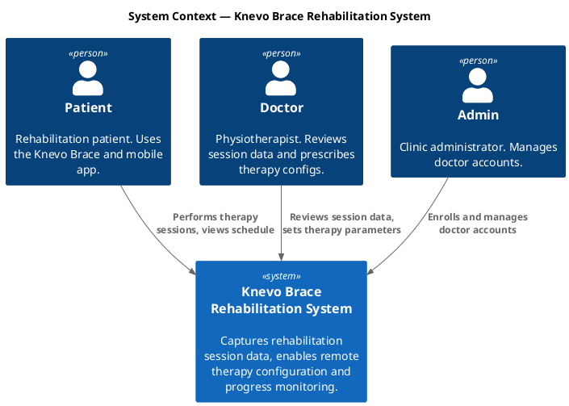
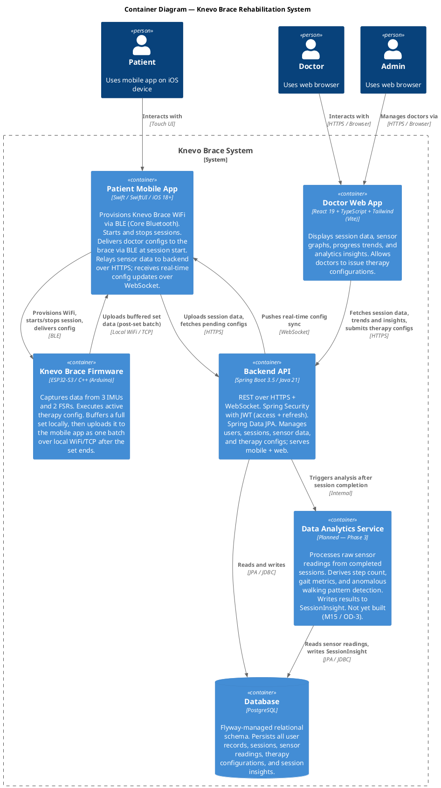
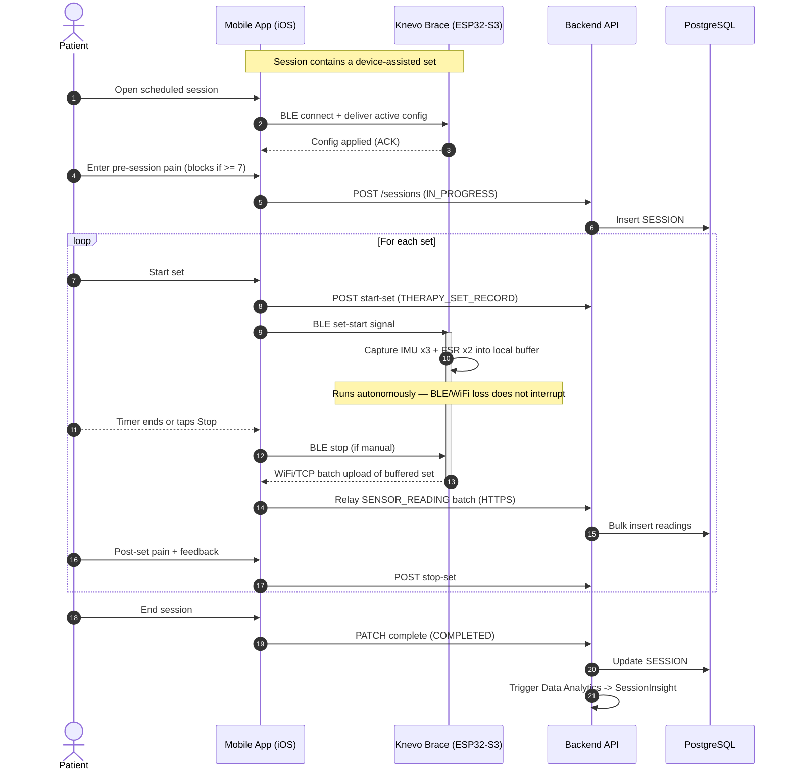
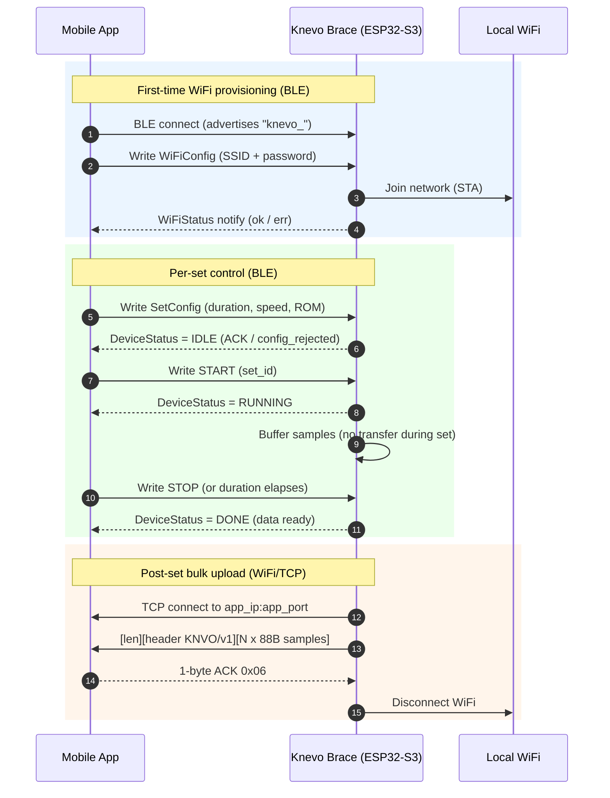
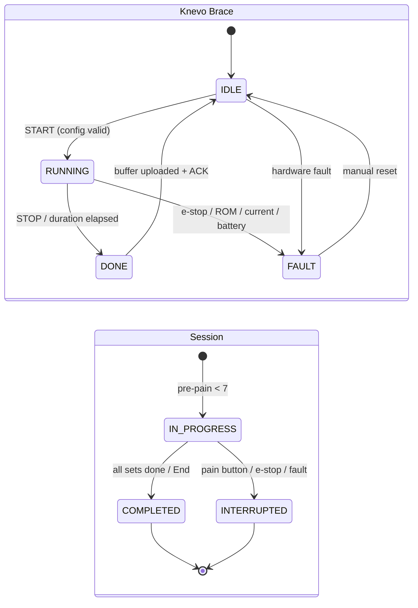
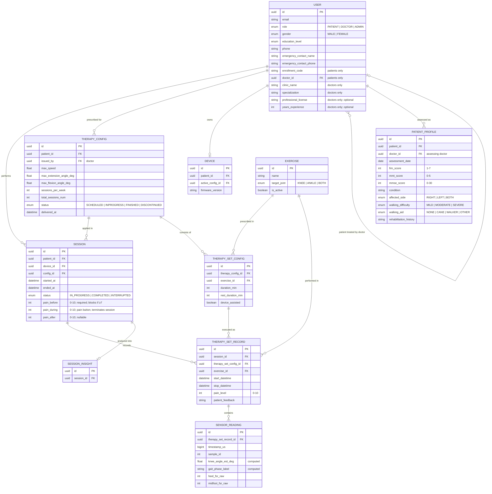
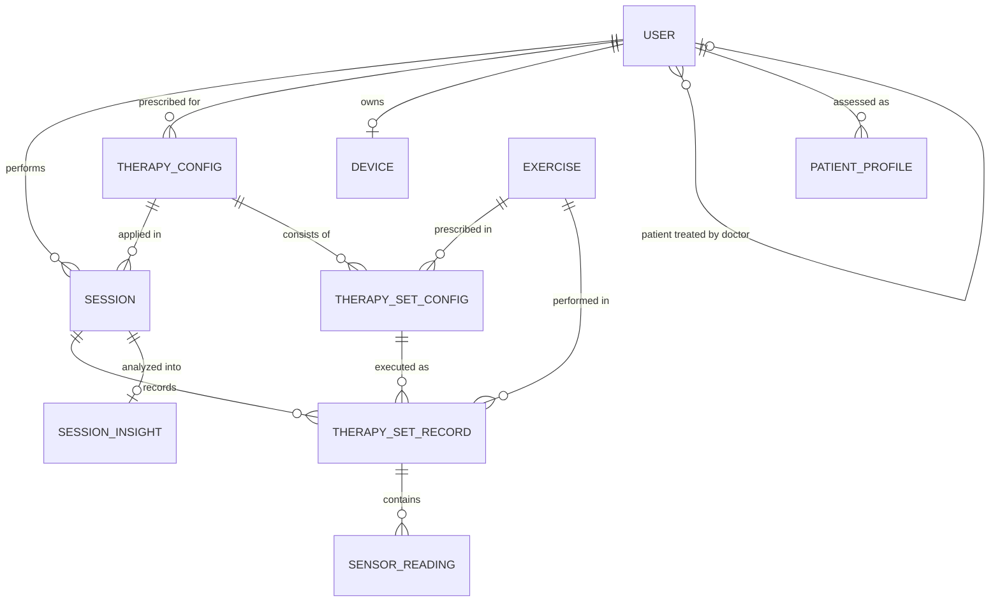

# Knevo Brace Rehabilitation System — Specification & Architecture

> **Audience:** Any agent or engineer picking up work on this project. Read this first. It is the single source of truth for goals, constraints, and architecture decisions.

---

## 1. System Goal

Build the **Knevo Brace**, a right-leg knee rehabilitation brace that supports patients during guided rehabilitation therapy. The system captures objective movement data during sessions, makes it visible to the patient's doctor, and allows the doctor to tune therapy parameters remotely.

This is a graduation project operating on a tight schedule. Simplicity and delivery speed take priority over long-term scalability. Single clinic, no multi-tenancy.

---

## 2. Customer Problems

| # | Problem | Who it affects |
|---|---------|---------------|
| P1 | Patients in rehabilitation exercise without objective feedback on movement quality | Patient |
| P2 | Doctors cannot track patient progress remotely — they rely on subjective self-reports between visits | Doctor |
| P3 | Therapy prescriptions are static — doctors cannot adjust parameters based on real performance data | Doctor |
| P4 | No easy channel for doctors to push updated therapy instructions without a physical visit | Patient + Doctor |
| P5 | No visibility into whether patients are following their prescribed therapy schedule and frequency | Doctor |

---

## 3. Core Functions

### Device & Session

- **WiFi provisioning** — mobile app provisions the device's WiFi credentials over BLE on first setup
- **Session lifecycle** — patient starts and stops therapy sessions from the mobile app; device executes the active therapy config
- **Sensor capture** — device captures data from 3 IMUs and 2 FSRs during active therapy sets only; capture begins when the patient starts a set and ends when the timer completes or the patient stops the set manually
- **Local buffering** — device buffers captured data to decouple capture from transmission; tolerates transient WiFi loss mid-session

### Data Pipeline

- **Device-to-app transfer** — at the end of each set the device uploads its buffered sensor data to the mobile app in one batch over local WiFi/TCP (seconds-level delay acceptable); retries on reconnect after a connectivity gap
- **App-to-backend upload** — mobile app relays session data to the backend over HTTPS

### Configuration & Prescription

- **Therapy configuration** — doctor sets: max speed, max range of motion, session duration, session frequency, and schedule
- **Config delivery** — doctor's config is stored in backend → pushed/fetched to mobile app → delivered to device over BLE at the start of the next session

### User Management

- **Patient self-registration** — patient registers from the mobile app
- **Enrollment** — patient generates a one-time enrollment code in the mobile app and shares it with their doctor; doctor enters the code in the web app to link the patient to their account
- **Doctor enrollment** — a single admin account enrolls doctors via the web app; no per-clinic hierarchy

### Doctor Dashboard

- Raw sensor graphs per session (knee angle over time, FSR load over time)
- Aggregated per-session stats (range of motion achieved, step count, session duration)
- Progress trends across sessions over time
- Therapy configuration panel (issue updated prescriptions)

### Data Analytics

- **Sensor processing** — after each session, the Data Analytics Service processes raw IMU and FSR readings to derive higher-level metrics: step count, cadence, gait phase distribution, and anomalous walking pattern detection
- **SessionInsight** — derived metrics are stored as a SessionInsight record linked to the session and surfaced in the doctor dashboard

---

## 4. Architecture

### 4.1 Characteristics

| Characteristic | Description |
|----------------|-------------|
| **Offline-tolerant device** | Device buffers data locally and retransmits on reconnect; sessions do not fail on transient WiFi loss |
| **Mobile-as-relay** | The mobile app is the data and control gateway between the device and the backend. The device never talks to the backend directly. |
| **BLE for control, WiFi for data** | BLE is used for WiFi provisioning, session start/stop signals, and config delivery. WiFi (local network) is used for bulk sensor data transfer from device to mobile app. |
| **Real-time config sync to app** | When the doctor updates a therapy config, the change is pushed to the patient's mobile app immediately if the app is connected to the internet. Session reminders update automatically without requiring the patient to open the app. |
| **Async config delivery to device** | The mobile app holds the latest config locally. The config is delivered to the Knevo Brace via BLE at the point the device is needed in a session (first device-assisted set). |
| **Single tenant** | One clinic, no multi-tenancy required |
| **iOS primary** | Mobile app targets iOS, built natively in Swift / SwiftUI. Android is out of scope. |

### 4.2 Constraints

- **Timeline** — graduation project; decisions must optimize for delivery speed
- **Hardware fixed** — ESP32-S3 microcontroller, right leg only, 3 IMUs + 2 FSRs; mechanical design is out of scope
- **Privacy** — no legal/regulatory obligations (no HIPAA, no GDPR), but patient health data must not be exposed without authentication; apply reasonable access controls
- **Single clinic** — no need for multi-tenant data isolation or per-clinic configuration

### 4.3 Key Decisions

> Originally open decisions (OD-x) that gated downstream work. OD-1 and OD-2 are now **resolved**; the resulting stack is captured in §4.3.1. OD-3 remains pending.

## OD-1: Backend Tech Stack

| Option | Pros | Cons |
|--------|------|------|
| Keep Firebase | Already partially in use; fast to prototype; built-in auth and real-time push | Limited query flexibility for analytics; less control; vendor lock-in |
| Switch to Spring Boot + PostgreSQL | Full SQL query power for analytics; industry-standard; more control | More setup time; requires hosting; more code to write |

**Decision:** switch to Spring Boot + PostgreSQL — **RESOLVED** (details in §4.3.1).

## OD-2: Separate vs Shared User Auth

Patients and doctors are separate user populations with no UI overlap. They can share the same backend user table with a `role` field, or be completely separate auth domains. Separate domains are cleaner but more setup.
**Decision:** single backend user table with `role: PATIENT | DOCTOR | ADMIN` — **RESOLVED**. Auth is stateless JWT (access + refresh); see §4.3.1.

## OD-3: SessionInsight Schema (Pending)

The Data Analytics Service produces derived insights from sensor readings — step count, gait metrics, anomaly flags. The output schema is not yet defined; it depends on the analytics algorithms chosen. **Do not implement the SessionInsight entity until the Data Analytics Service design is underway.**

---

### 4.3.1 Technology Stack (decided)

| Layer | Decision | Notes |
|-------|----------|-------|
| Backend | **Spring Boot 3.5 / Java 21** | Gradle (Kotlin DSL). Spring Web, Security, Data JPA, Validation, WebSocket |
| Database | **PostgreSQL** | Schema managed by **Flyway** migrations; accessed via Spring Data JPA / Hibernate |
| Auth | **Stateless JWT** | Single `USER` table with `role` (OD-2); short-lived access token + refresh token; `io.jsonwebtoken` (jjwt) |
| Web app | **React 19 + TypeScript + Tailwind CSS**, built with **Vite** | TanStack Query for server state; axios; Recharts for sensor/progress graphs |
| Mobile app | **Swift / SwiftUI**, iOS 18+ | Native; Core Bluetooth for BLE; Xcode project generated by XcodeGen |
| Firmware | **ESP32-S3 / C++ (Arduino)** | 3 IMUs + 2 FSRs; on-device buffering; post-set WiFi/TCP batch upload |
| Real-time | **WebSocket** (backend → mobile) | Drives real-time config sync (Flow 3). The web app uses HTTPS request/polling, not WebSocket |
| Data Analytics | **Planned — Phase 3** | Not yet built (M15); SessionInsight schema pending (OD-3) |

### 4.3.2 Deployment (decided)

| Aspect | Decision |
|--------|----------|
| Host | Single **DigitalOcean droplet** (1 vCPU / 2 GB), domain `knevo.appscorner.com` |
| Edge | **nginx** serves the built web bundle and reverse-proxies `/api` to the backend; **TLS via Let's Encrypt** (certbot) |
| Backend runtime | Runs as a **systemd service** from an uber-jar — **no Docker** in production (leaner on 1 vCPU) |
| Database | **PostgreSQL** on the same droplet; a `pg_dump` backup is taken before each deploy |
| CI/CD | **GitHub Actions** builds `bootJar` + the web bundle and attaches them to a GitHub Release; `deploy/deploy.sh` on the droplet pulls and swaps them in |
| Local dev | Backend as a host JVM process; **PostgreSQL in Docker** |

---

### 4.4 C4 Context Diagram

---

### 4.5 C4 Container Diagram

---

### 4.5.1 Therapy Session — Sequence (end-to-end)

---

### 4.5.2 Knevo Brace Integration — BLE control + WiFi batch upload

---

### 4.5.3 State Machines — Brace device & Session lifecycle

---

## 4.6 Key Data Flows

---

### Flow 1 — Therapy Session

#### Actors

- **Patient** — interacts with the mobile app
- **Mobile App** — controls BLE, relays data, tracks session state
- **Device (ESP32-S3)** — captures sensor data during device-assisted sets
- **Backend** — persists all records

#### Pre-condition

Mobile app holds the latest TherapyConfig (synced in real-time when internet is available — see Flow 3).

#### Happy Path

Phase 1 — Session Open

| Event | Who | Outcome |
|-------|-----|---------|
| Patient opens scheduled session in app | Patient | App inspects the set list |
| Session contains at least one device-assisted set | Mobile App | App initiates BLE scan and connects to device |
| BLE connected | Mobile App | Pending config delivered to device over BLE |
| Patient taps "Start Session" | Patient | SESSION record created (`IN_PROGRESS`) |

**Phase 2 — Set Execution Loop** *(repeated for each set)*

| Event | Who | Outcome |
|-------|-----|---------|
| Patient taps "Start Set" | Patient | THERAPY_SET_RECORD created (`start_datetime` set) |
| *If device-assisted:* set start signal sent to device | Mobile App → Device | Device begins sensor capture into its local buffer (nominal 100 Hz; see SensorReading note) |
| Samples accumulate in the device buffer | Device | No transfer during the set — data is held locally until the set ends |
| Timer completes **or** patient taps "Stop Set" | Patient / Timer | Capture stops; device uploads the buffered set to the app over WiFi/TCP; app relays to backend via HTTPS (seconds delay); THERAPY_SET_RECORD updated (`stop_datetime` set) |
| Patient inputs pain level (0–10) and optional feedback | Patient | THERAPY_SET_RECORD updated |
| No remaining device-assisted sets in session | Mobile App | BLE connection dropped |

Phase 3 — Session End

| Event | Who | Outcome |
|-------|-----|---------|
| All sets complete **or** patient taps "End Session" | Patient | SESSION updated (`COMPLETED` or `INTERRUPTED`) |
| Any remaining buffered sensor data flushed | Mobile App | All SENSOR_READING rows confirmed in backend |

### Connectivity Loss Mid-Set

| Scenario | Behaviour |
|----------|-----------|
| WiFi lost during device-assisted set | Device buffers sensor data locally; uploads the batch once WiFi restores |
| BLE lost during device-assisted set | No impact — BLE is only needed to send the set-start signal. Once the set is underway, all data flows over local WiFi. |

> **Decision:** A config change made while the patient is mid-session takes effect from the next session only. The running session completes under the config that was active when it started (`SESSION.config_id`).

---

## Flow 2 — Doctor Issues Therapy Config

| Event | Who | Outcome |
|-------|-----|---------|
| Doctor sets config parameters in web app | Doctor | Web app POSTs to backend |
| Backend stores TherapyConfig (`SCHEDULED`) | Backend | Config stored; `delivered_at = null` |
| Backend pushes update to patient's mobile app | Backend → Mobile App | Mobile app receives and stores config locally |
| Session reminders updated automatically | Mobile App | No user action required |
| Patient opens next session with device-assisted sets | Patient | App connects via BLE and delivers config to device |
| Config confirmed delivered | Mobile App | `delivered_at` timestamp set on TherapyConfig |

---

## Flow 3 — Real-Time Config Sync

The mobile app must always hold the latest config without requiring the patient to open the app.

| Condition | Behaviour |
|-----------|-----------|
| Mobile app is online when doctor saves config | Backend pushes update immediately; app receives and stores config; reminders updated |
| Mobile app is offline when doctor saves config | Config is queued in backend; delivered on next app connectivity |
| Patient opens app after being offline | App syncs latest config on startup |

> **Decision:** Session reminders are driven by the `schedule` field (days of week) in the active TherapyConfig. The mobile app schedules a local push notification on each configured day to remind the patient they have a session. Time of day is an implementation detail to be determined.

---

## Flow 4 — WiFi Loss Mid-Session

| Event | Behaviour |
|-------|-----------|
| Device detects WiFi loss | Continues capturing and buffering locally |
| WiFi restored | Device uploads buffered data to mobile app |
| Session completes before WiFi restored | Buffered data uploaded at next connectivity opportunity |

---

## 5. Data Model

> High-level entities only. Expand per-feature as needed. Full column detail for each entity is in the tables below the diagram.

**Compact view — entities and relationships only** (for slides / at-a-glance):

---

> **Note on SENSOR_READING:** Only key columns are shown in the diagram. See the full column table below for all 18 IMU channels, 2 FSR channels, and computed fields.
>
> **Note on SESSION_INSIGHT:** Structure is a pending decision (OD-3). Entity shown to preserve the relationship. Do not implement until the Data Analytics Service design begins.

---

### User

Single table for all user types; `role` determines which fields are applicable.

> **Simplifying decision:** A user can only hold one role — a doctor cannot also be a patient in the same system. This is an intentional scope constraint for this project and can be extended to a many-roles model in the future if needed.

| Field | Notes |
|-------|-------|
| `id` | UUID |
| `email` | Unique |
| `name` | Full name |
| `gender` | `MALE`, `FEMALE` |
| `birth_date` | Date |
| `education_level` | `NO_FORMAL_EDUCATION`, `PRIMARY`, `HIGH_SCHOOL`, `TECHNICAL_VOCATIONAL`, `GRADUATE`, `POST_GRADUATE` |
| `phone` | |
| `emergency_contact_name` | Patients: name of person to call in emergency. Doctors: name of assistant who can be reached when the doctor is needed urgently. |
| `emergency_contact_phone` | Corresponding phone number for emergency contact |
| `role` | `PATIENT`, `DOCTOR`, `ADMIN` |
| `enrollment_code` | Patients only — one-time code shared with doctor to complete enrollment |
| `doctor_id` | Patients only — FK → User (Doctor); set when doctor redeems enrollment code |
| `clinic_name` | Doctors only — clinic or hospital name |
| `specialization` | Doctors only — e.g. Physiotherapy, Neurology |
| `professional_license` | Doctors only — professional ID or license number; optional |
| `years_experience` | Doctors only — integer; optional |
| `created_at` | |

---

### PatientProfile

A point-in-time clinical snapshot of a patient. Multiple records can exist per patient as the patient is reassessed over time. The `doctor_id` here captures the assessing doctor at the time of the snapshot — this may differ from the treating doctor in USER.doctor_id if the patient's care transfers between assessments.

| Field | Notes |
|-------|-------|
| `id` | UUID |
| `patient_id` | FK → User (Patient) |
| `doctor_id` | FK → User (Doctor) — the assessing doctor at time of this snapshot |
| `assessment_date` | Date of assessment |
| `weight_kg` | |
| `height_cm` | |
| `fim_score` | 1–7; Functional Independence Measure |
| `mmt_score` | 0–5; Oxford Manual Muscle Test (MRC scale) |
| `mmse_score` | 0–30; Mini Mental State Examination. 24–30: Normal; 18–23: Mild impairment; 10–17: Moderate impairment; 0–9: Severe impairment |
| `can_follow_instructions` | 0–10 |
| `needs_supervision` | Boolean |
| `home_exercise_permission` | Boolean — controls whether patient is permitted to use the device outside supervised sessions |
| `condition` | Free text description of the patient's medical condition |
| `affected_side` | `RIGHT`, `LEFT`, `BOTH` |
| `walking_difficulty` | `MILD`, `MODERATE`, `SEVERE` |
| `walking_aid` | `NONE`, `CANE`, `WALKER`, `OTHER` |
| `rehabilitation_history` | Free text description of prior rehabilitation history |
| `notes` | Free text clinical notes |

---

### Device

| Field | Notes |
|-------|-------|
| `id` | UUID or MAC address |
| `patient_id` | FK → User (Patient) |
| `firmware_version` | For compatibility tracking |
| `active_config_id` | FK → TherapyConfig; last config delivered to device |

---

### TherapyConfig

| Field | Notes |
|-------|-------|
| `id` | UUID |
| `patient_id` | FK → User (Patient) |
| `issued_by` | FK → User (Doctor) |
| `max_speed` | Units TBD by hardware team |
| `max_extension_angle_deg` | Maximum knee extension angle in degrees |
| `max_flexion_angle_deg` | Maximum knee flexion angle in degrees |
| `sessions_per_week` | Frequency |
| `schedule` | Days of week, e.g. Mon/Wed/Fri |
| `total_sessions_num` | Total number of sessions prescribed in this therapy program |
| `status` | `SCHEDULED`, `INPROGRESS`, `FINISHED`, `DISCONTINUED` |
| `comment` | Doctor's notes on this config |
| `created_at` | |
| `delivered_at` | Null until confirmed delivered to device |

---

### Exercise

Reference list of knee and ankle rehabilitation exercises. Exercises must not be hard-deleted once referenced by historical records — use `is_active = false` to retire an exercise.

> **Seed data:** A sample dataset of standard physiotherapy exercises will be created alongside the database migration (see task: *Populate sample exercise reference data*).

| Field | Notes |
|-------|-------|
| `id` | UUID |
| `name` | Exercise name |
| `description` | Full description and instructions |
| `target_joint` | `KNEE`, `ANKLE`, `BOTH` |
| `is_active` | Boolean — false to retire; never hard-delete |

---

### TherapySetConfig

Describes the individual sets that compose a therapy config. Each TherapyConfig consists of one or more ordered sets, each prescribing a specific exercise with duration and rest guidance.

| Field | Notes |
|-------|-------|
| `id` | UUID |
| `therapy_config_id` | FK → TherapyConfig |
| `exercise_id` | FK → Exercise |
| `device_assisted` | Boolean — whether the Knevo Brace actively assists during this set |
| `duration_min` | Duration of the set in minutes |
| `rest_duration_min` | Rest time after the set in minutes |

---

### Session

| Field | Notes |
|-------|-------|
| `id` | UUID |
| `patient_id` | FK → User (Patient) |
| `device_id` | FK → Device |
| `config_id` | FK → TherapyConfig applied during this session |
| `started_at` | |
| `ended_at` | Null while in progress |
| `status` | `IN_PROGRESS`, `COMPLETED`, `INTERRUPTED` |
| `pain_before` | 0–10; required before session starts; session is blocked if value ≥ 7 |
| `pain_during` | 0–10; nullable; entered when patient presses the in-session pain button; triggers immediate session termination |
| `pain_after` | 0–10; nullable; entered after session ends; may be absent if session terminated abruptly |

---

### TherapySetRecord

Captures the actual execution of each set within a session, including patient-reported pain and feedback after the set. Fields that mirror TherapySetConfig are denormalized here to preserve a snapshot of the prescription as it was at execution time.

| Field | Notes |
|-------|-------|
| `id` | UUID |
| `session_id` | FK → Session |
| `therapy_set_config_id` | FK → TherapySetConfig |
| `exercise_id` | FK → Exercise — exercises are a stable reference list; no snapshot needed |
| `device_assisted` | Boolean — actual device assistance used (may differ from plan) |
| `planned_duration_min` | Copied from TherapySetConfig at execution time |
| `planned_rest_duration_min` | Copied from TherapySetConfig at execution time |
| `start_datetime` | |
| `stop_datetime` | |
| `pain_level` | 0–10; patient-reported pain after the set (standard clinical pain scale; presented as a labelled list in the UI) |
| `patient_feedback` | Free text patient input after the set |

---

### SensorReading

One row per sample captured by the device. Nominal sample rate 100 Hz (validated at 95–105 Hz on the standalone capture firmware). The integrated brace's achieved rate may be variable and sub-100 Hz under on-device processing load, so consumers must key on `timestamp_us` rather than assume a fixed cadence. IMU placement: foot, shank, thigh (right leg). FSR placement: heel, midfoot.

| Field | Notes |
|-------|-------|
| `id` | UUID |
| `therapy_set_record_id` | FK → TherapySetRecord — sensor capture is bounded by set start/stop; no readings exist outside an active set |
| `timestamp_us` | Device-side timestamp in microseconds |
| `sample_id` | Sequential sample index within the session |
| **Foot IMU** | |
| `foot_ax_g` | Foot accelerometer X axis (g) |
| `foot_ay_g` | Foot accelerometer Y axis (g) |
| `foot_az_g` | Foot accelerometer Z axis (g) |
| `foot_gx_rad_s` | Foot gyroscope X axis (rad/s) |
| `foot_gy_rad_s` | Foot gyroscope Y axis (rad/s) |
| `foot_gz_rad_s` | Foot gyroscope Z axis (rad/s) |
| **Shank IMU** | |
| `shank_ax_g` | Shank accelerometer X axis (g) |
| `shank_ay_g` | Shank accelerometer Y axis (g) |
| `shank_az_g` | Shank accelerometer Z axis (g) |
| `shank_gx_rad_s` | Shank gyroscope X axis (rad/s) |
| `shank_gy_rad_s` | Shank gyroscope Y axis (rad/s) |
| `shank_gz_rad_s` | Shank gyroscope Z axis (rad/s) |
| **Thigh IMU** | |
| `thigh_ax_g` | Thigh accelerometer X axis (g) |
| `thigh_ay_g` | Thigh accelerometer Y axis (g) |
| `thigh_az_g` | Thigh accelerometer Z axis (g) |
| `thigh_gx_rad_s` | Thigh gyroscope X axis (rad/s) |
| `thigh_gy_rad_s` | Thigh gyroscope Y axis (rad/s) |
| `thigh_gz_rad_s` | Thigh gyroscope Z axis (rad/s) |
| **Force Sensitive Resistors** | |
| `heel_fsr_raw` | Heel FSR raw ADC value (0–4095) |
| `midfoot_fsr_raw` | Midfoot FSR raw ADC value (0–4095) |
| **Computed fields** | |
| `heel_contact` | -1 = unlabeled, 0 = no contact, 1 = contact |
| `midfoot_contact` | -1 = unlabeled, 0 = no contact, 1 = contact |
| `gait_phase_id` | Integer phase ID; -1 = unlabeled |
| `gait_phase_label` | e.g. `STANCE`, `SWING`, `HEEL_STRIKE`, `TOE_OFF`, `unlabeled` |
| `knee_angle_est_deg` | Estimated knee angle in degrees; null until computed |

---

### SessionInsight

> **Pending Decision (OD-3):** The structure of this entity is not yet defined. It depends on the output schema of the Data Analytics Service. A placeholder is shown in the ER diagram to preserve the relationship. Define this entity when the Data Analytics Service design begins.

| Field | Notes |
|-------|-------|
| `id` | UUID |
| `session_id` | FK → Session |
| *(remaining fields TBD)* | |

---

## 6. Out of Scope

- Mechanical/hardware design of the Knevo Brace
- Android support (the mobile app is native Swift/SwiftUI; iOS only)
- Multi-clinic / multi-tenant support
- Real-time alerts to doctors during sessions
- Legal compliance frameworks (HIPAA, GDPR, etc.)
- Left leg support
