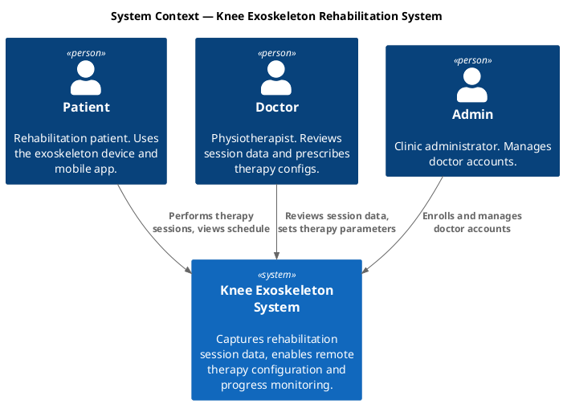
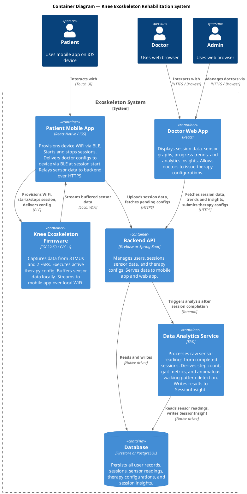
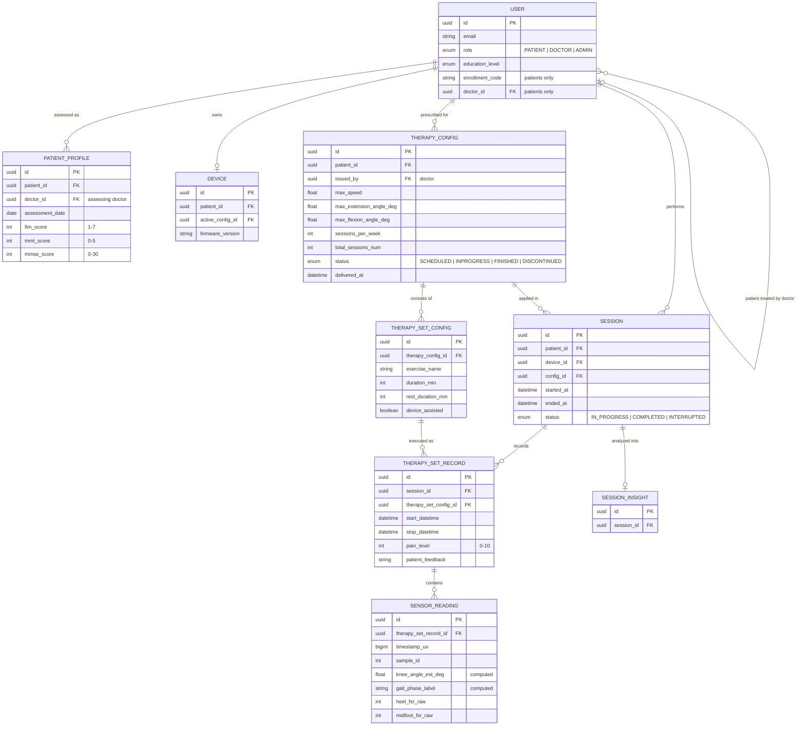

# Knee Exoskeleton Rehabilitation System — Specification & Architecture

> **Audience:** Any agent or engineer picking up work on this project. Read this first. It is the single source of truth for goals, constraints, and architecture decisions.

---

## 1. System Goal

Build a right-leg knee exoskeleton system that supports patients during guided rehabilitation therapy. The system captures objective movement data during sessions, makes it visible to the patient's doctor, and allows the doctor to tune therapy parameters remotely.

This is a graduation project operating on a tight schedule. Simplicity and delivery speed take priority over long-term scalability. Single clinic, no multi-tenancy.

---

## 2. Customer Problems

| # | Problem | Who it affects |
|---|---------|---------------|
| P1 | Patients in rehabilitation exercise without objective feedback on movement quality | Patient |
| P2 | Doctors cannot track patient progress remotely — they rely on subjective self-reports between visits | Doctor |
| P3 | Therapy prescriptions are static — doctors cannot adjust parameters based on real performance data | Doctor |
| P4 | No easy channel for doctors to push updated therapy instructions without a physical visit | Patient + Doctor |
| P5 | No visibility into whether patients are following their prescribed therapy schedule and frequency | Doctor |

---

## 3. Core Functions

### Device & Session

- **WiFi provisioning** — mobile app provisions the device's WiFi credentials over BLE on first setup
- **Session lifecycle** — patient starts and stops therapy sessions from the mobile app; device executes the active therapy config
- **Sensor capture** — device captures data from 3 IMUs and 2 FSRs during active therapy sets only; capture begins when the patient starts a set and ends when the timer completes or the patient stops the set manually
- **Local buffering** — device buffers captured data to decouple capture from transmission; tolerates transient WiFi loss mid-session

### Data Pipeline

- **Device-to-app relay** — device streams buffered sensor data to the mobile app over local WiFi (seconds-level delay acceptable); re-transmits any buffered data on reconnect after a connectivity gap
- **App-to-backend upload** — mobile app relays session data to the backend over HTTPS

### Configuration & Prescription

- **Therapy configuration** — doctor sets: max speed, max range of motion, session duration, session frequency, and schedule
- **Config delivery** — doctor's config is stored in backend → pushed/fetched to mobile app → delivered to device over BLE at the start of the next session

### User Management

- **Patient self-registration** — patient registers from the mobile app
- **Enrollment** — patient generates a one-time enrollment code in the mobile app and shares it with their doctor; doctor enters the code in the web app to link the patient to their account
- **Doctor enrollment** — a single admin account enrolls doctors via the web app; no per-clinic hierarchy

### Doctor Dashboard

- Raw sensor graphs per session (knee angle over time, FSR load over time)
- Aggregated per-session stats (range of motion achieved, step count, session duration)
- Progress trends across sessions over time
- Therapy configuration panel (issue updated prescriptions)

### Data Analytics

- **Sensor processing** — after each session, the Data Analytics Service processes raw IMU and FSR readings to derive higher-level metrics: step count, cadence, gait phase distribution, and anomalous walking pattern detection
- **SessionInsight** — derived metrics are stored as a SessionInsight record linked to the session and surfaced in the doctor dashboard

---

## 4. Architecture

### 4.1 Characteristics

| Characteristic | Description |
|----------------|-------------|
| **Offline-tolerant device** | Device buffers data locally and retransmits on reconnect; sessions do not fail on transient WiFi loss |
| **Mobile-as-relay** | The mobile app is the data and control gateway between the device and the backend. The device never talks to the backend directly. |
| **BLE for control, WiFi for data** | BLE is used for WiFi provisioning, session start/stop signals, and config delivery. WiFi (local network) is used for bulk sensor data transfer from device to mobile app. |
| **Async config delivery** | Doctor configs are not pushed in real time to the device; they are staged in the backend and delivered at the next session start |
| **Single tenant** | One clinic, no multi-tenancy required |
| **iOS primary** | Mobile app targets iOS. React Native used, so Android is theoretically possible but not tested. |

### 4.2 Constraints

- **Timeline** — graduation project; decisions must optimize for delivery speed
- **Hardware fixed** — ESP32-S3 microcontroller, right leg only, 3 IMUs + 2 FSRs; mechanical design is out of scope
- **Privacy** — no legal/regulatory obligations (no HIPAA, no GDPR), but patient health data must not be exposed without authentication; apply reasonable access controls
- **Single clinic** — no need for multi-tenant data isolation or per-clinic configuration

### 4.3 Open Decisions

> These must be resolved early as they affect all downstream work.

## OD-1: Backend Tech Stack

| Option | Pros | Cons |
|--------|------|------|
| Keep Firebase | Already partially in use; fast to prototype; built-in auth and real-time push | Limited query flexibility for analytics; less control; vendor lock-in |
| Switch to Spring Boot + PostgreSQL | Full SQL query power for analytics; industry-standard; more control | More setup time; requires hosting; more code to write |

**Recommendation:** If the doctor dashboard's analytics are simple (filters, date ranges, per-session views), stay with Firebase. If complex aggregations or joins are needed, switch to Spring Boot + PostgreSQL. Decide before writing any backend analytics code.

## OD-2: Separate vs Shared User Auth

Patients and doctors are separate user populations with no UI overlap. They can share the same backend user table with a `role` field, or be completely separate auth domains. Separate domains are cleaner but more setup. Recommend: single backend user table with `role: PATIENT | DOCTOR | ADMIN`.

## OD-3: SessionInsight Schema (Pending)

The Data Analytics Service produces derived insights from sensor readings — step count, gait metrics, anomaly flags. The output schema is not yet defined; it depends on the analytics algorithms chosen. **Do not implement the SessionInsight entity until the Data Analytics Service design is underway.**

---

### 4.4 C4 Context Diagram

---

### 4.5 C4 Container Diagram

---

### 4.6 Key Data Flows

## Therapy Session (Happy Path)

1. Patient opens mobile app → app connects to device via BLE
2. App fetches pending doctor config from backend → delivers config to device via BLE
3. Patient starts session in app → start signal sent to device via BLE
4. Device captures IMU + FSR data → buffers locally → streams to mobile app via local WiFi
5. Mobile app receives data → uploads to backend via HTTPS (near real-time, seconds delay)
6. Patient stops session in app → stop signal sent via BLE → any remaining buffered data flushed

## Doctor Issues New Config

1. Doctor sets config (speed, ROM, duration, frequency, schedule) in web app
2. Web app posts config to backend → stored against patient record
3. Next time patient's mobile app polls/receives push → fetches pending config
4. At next session start (step 2 above) → config delivered to device via BLE

## WiFi Loss Mid-Session

1. Device detects WiFi loss → continues capturing and buffering locally
2. WiFi restored → device resumes streaming buffered data to mobile app
3. Session integrity preserved; no data loss within device buffer capacity

---

## 5. Data Model

> High-level entities only. Expand per-feature as needed. Full column detail for each entity is in the tables below the diagram.

> **Note on SENSOR_READING:** Only key columns are shown in the diagram. See the full column table below for all 18 IMU channels, 2 FSR channels, and computed fields.

> **Note on SESSION_INSIGHT:** Structure is a pending decision (OD-3). Entity shown to preserve the relationship. Do not implement until the Data Analytics Service design begins.

---

### User

Single table for all user types; `role` determines which fields are applicable.

> **Simplifying decision:** A user can only hold one role — a doctor cannot also be a patient in the same system. This is an intentional scope constraint for this project and can be extended to a many-roles model in the future if needed.

| Field | Notes |
|-------|-------|
| `id` | UUID |
| `email` | Unique |
| `name` | Full name |
| `gender` | `MALE`, `FEMALE`, `OTHER`, `PREFER_NOT_TO_SAY` |
| `birth_date` | Date |
| `education_level` | `NO_FORMAL_EDUCATION`, `PRIMARY`, `HIGH_SCHOOL`, `TECHNICAL_VOCATIONAL`, `GRADUATE`, `POST_GRADUATE` |
| `role` | `PATIENT`, `DOCTOR`, `ADMIN` |
| `enrollment_code` | Patients only — one-time code shared with doctor to complete enrollment |
| `doctor_id` | Patients only — FK → User (Doctor); set when doctor redeems enrollment code |
| `created_at` | |

---

### PatientProfile

A point-in-time clinical snapshot of a patient. Multiple records can exist per patient as the patient is reassessed over time. The `doctor_id` here captures the assessing doctor at the time of the snapshot — this may differ from the treating doctor in USER.doctor_id if the patient's care transfers between assessments.

| Field | Notes |
|-------|-------|
| `id` | UUID |
| `patient_id` | FK → User (Patient) |
| `doctor_id` | FK → User (Doctor) — the assessing doctor at time of this snapshot |
| `assessment_date` | Date of assessment |
| `weight_kg` | |
| `height_cm` | |
| `fim_score` | 1–7; Functional Independence Measure |
| `mmt_score` | 0–5; Oxford Manual Muscle Test (MRC scale) |
| `mmse_score` | 0–30; Mini Mental State Examination. 24–30: Normal; 18–23: Mild impairment; 10–17: Moderate impairment; 0–9: Severe impairment |
| `can_follow_instructions` | 0–10 |
| `needs_supervision` | Boolean |
| `home_exercise_permission` | Boolean — controls whether patient is permitted to use the device outside supervised sessions |
| `notes` | Free text clinical notes |

---

### Device

| Field | Notes |
|-------|-------|
| `id` | UUID or MAC address |
| `patient_id` | FK → User (Patient) |
| `firmware_version` | For compatibility tracking |
| `active_config_id` | FK → TherapyConfig; last config delivered to device |

---

### TherapyConfig

| Field | Notes |
|-------|-------|
| `id` | UUID |
| `patient_id` | FK → User (Patient) |
| `issued_by` | FK → User (Doctor) |
| `max_speed` | Units TBD by hardware team |
| `max_extension_angle_deg` | Maximum knee extension angle in degrees |
| `max_flexion_angle_deg` | Maximum knee flexion angle in degrees |
| `sessions_per_week` | Frequency |
| `schedule` | Days of week, e.g. Mon/Wed/Fri |
| `total_sessions_num` | Total number of sessions prescribed in this therapy program |
| `status` | `SCHEDULED`, `INPROGRESS`, `FINISHED`, `DISCONTINUED` |
| `comment` | Doctor's notes on this config |
| `created_at` | |
| `delivered_at` | Null until confirmed delivered to device |

---

### TherapySetConfig

Describes the individual sets that compose a therapy config. Each TherapyConfig consists of one or more ordered sets, each prescribing a specific exercise with duration and rest guidance.

| Field | Notes |
|-------|-------|
| `id` | UUID |
| `therapy_config_id` | FK → TherapyConfig |
| `device_assisted` | Boolean — whether the exoskeleton actively assists during this set |
| `exercise_name` | Name of the exercise |
| `duration_min` | Duration of the set in minutes |
| `rest_duration_min` | Rest time after the set in minutes |
| `exercise_description` | Free text description or instructions |

---

### Session

| Field | Notes |
|-------|-------|
| `id` | UUID |
| `patient_id` | FK → User (Patient) |
| `device_id` | FK → Device |
| `config_id` | FK → TherapyConfig applied during this session |
| `started_at` | |
| `ended_at` | Null while in progress |
| `status` | `IN_PROGRESS`, `COMPLETED`, `INTERRUPTED` |

---

### TherapySetRecord

Captures the actual execution of each set within a session, including patient-reported pain and feedback after the set. Fields that mirror TherapySetConfig are denormalized here to preserve a snapshot of the prescription as it was at execution time.

| Field | Notes |
|-------|-------|
| `id` | UUID |
| `session_id` | FK → Session |
| `therapy_set_config_id` | FK → TherapySetConfig |
| `device_assisted` | Boolean — actual device assistance used (may differ from plan) |
| `exercise_name` | Snapshot of exercise name at execution time |
| `planned_duration_min` | Copied from TherapySetConfig at execution time |
| `planned_rest_duration_min` | Copied from TherapySetConfig at execution time |
| `start_datetime` | |
| `stop_datetime` | |
| `pain_level` | 0–10; patient-reported pain after the set (standard clinical pain scale; presented as a labelled list in the UI) |
| `patient_feedback` | Free text patient input after the set |

---

### SensorReading

One row per sample streamed from the device. Sample rate: 100 Hz. IMU placement: foot, shank, thigh (right leg). FSR placement: heel, midfoot.

| Field | Notes |
|-------|-------|
| `id` | UUID |
| `therapy_set_record_id` | FK → TherapySetRecord — sensor capture is bounded by set start/stop; no readings exist outside an active set |
| `timestamp_us` | Device-side timestamp in microseconds |
| `sample_id` | Sequential sample index within the session |
| **Foot IMU** | |
| `foot_ax_g` | Foot accelerometer X axis (g) |
| `foot_ay_g` | Foot accelerometer Y axis (g) |
| `foot_az_g` | Foot accelerometer Z axis (g) |
| `foot_gx_rad_s` | Foot gyroscope X axis (rad/s) |
| `foot_gy_rad_s` | Foot gyroscope Y axis (rad/s) |
| `foot_gz_rad_s` | Foot gyroscope Z axis (rad/s) |
| **Shank IMU** | |
| `shank_ax_g` | Shank accelerometer X axis (g) |
| `shank_ay_g` | Shank accelerometer Y axis (g) |
| `shank_az_g` | Shank accelerometer Z axis (g) |
| `shank_gx_rad_s` | Shank gyroscope X axis (rad/s) |
| `shank_gy_rad_s` | Shank gyroscope Y axis (rad/s) |
| `shank_gz_rad_s` | Shank gyroscope Z axis (rad/s) |
| **Thigh IMU** | |
| `thigh_ax_g` | Thigh accelerometer X axis (g) |
| `thigh_ay_g` | Thigh accelerometer Y axis (g) |
| `thigh_az_g` | Thigh accelerometer Z axis (g) |
| `thigh_gx_rad_s` | Thigh gyroscope X axis (rad/s) |
| `thigh_gy_rad_s` | Thigh gyroscope Y axis (rad/s) |
| `thigh_gz_rad_s` | Thigh gyroscope Z axis (rad/s) |
| **Force Sensitive Resistors** | |
| `heel_fsr_raw` | Heel FSR raw ADC value (0–4095) |
| `midfoot_fsr_raw` | Midfoot FSR raw ADC value (0–4095) |
| **Computed fields** | |
| `heel_contact` | -1 = unlabeled, 0 = no contact, 1 = contact |
| `midfoot_contact` | -1 = unlabeled, 0 = no contact, 1 = contact |
| `gait_phase_id` | Integer phase ID; -1 = unlabeled |
| `gait_phase_label` | e.g. `STANCE`, `SWING`, `HEEL_STRIKE`, `TOE_OFF`, `unlabeled` |
| `knee_angle_est_deg` | Estimated knee angle in degrees; null until computed |

---

### SessionInsight

> **Pending Decision (OD-3):** The structure of this entity is not yet defined. It depends on the output schema of the Data Analytics Service. A placeholder is shown in the ER diagram to preserve the relationship. Define this entity when the Data Analytics Service design begins.

| Field | Notes |
|-------|-------|
| `id` | UUID |
| `session_id` | FK → Session |
| *(remaining fields TBD)* | |

---

## 6. Out of Scope

- Mechanical/hardware design of the exoskeleton
- Android testing (theoretically supported by React Native but not validated)
- Multi-clinic / multi-tenant support
- Real-time alerts to doctors during sessions
- Legal compliance frameworks (HIPAA, GDPR, etc.)
- Left leg support
