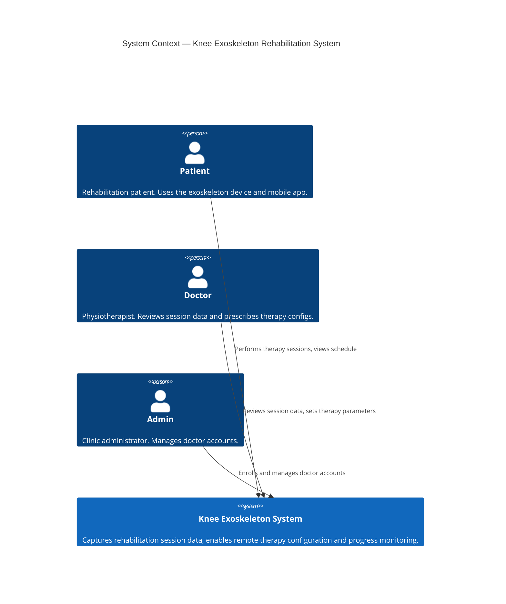
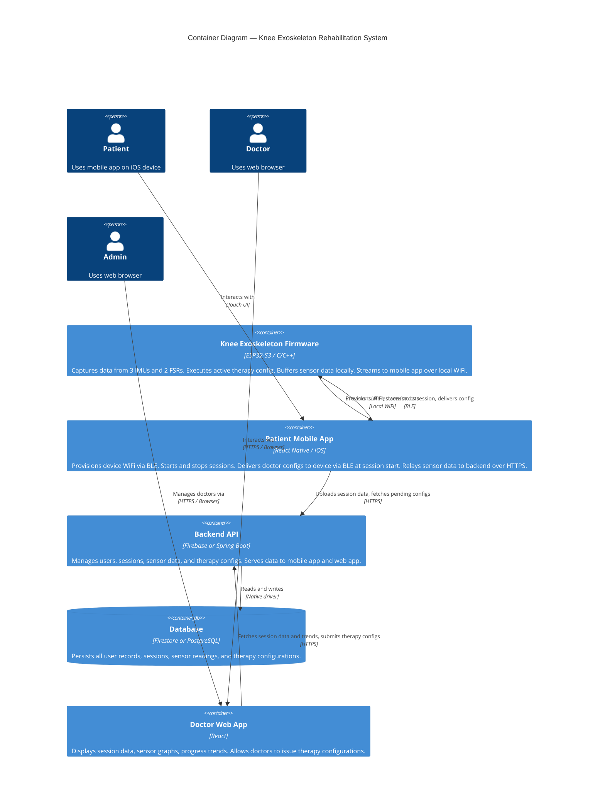

# Knee Exoskeleton Rehabilitation System — Specification & Architecture

> **Audience:** Any agent or engineer picking up work on this project. Read this first. It is the single source of truth for goals, constraints, and architecture decisions.

---

## 1. System Goal

Build a right-leg knee exoskeleton system that supports patients during guided rehabilitation therapy. The system captures objective movement data during sessions, makes it visible to the patient's doctor, and allows the doctor to tune therapy parameters remotely.

This is a graduation project operating on a tight schedule. Simplicity and delivery speed take priority over long-term scalability. Single clinic, no multi-tenancy.

---

## 2. Customer Problems

| # | Problem | Who it affects |
|---|---------|---------------|
| P1 | Patients in rehabilitation exercise without objective feedback on movement quality | Patient |
| P2 | Doctors cannot track patient progress remotely — they rely on subjective self-reports between visits | Doctor |
| P3 | Therapy prescriptions are static — doctors cannot adjust parameters based on real performance data | Doctor |
| P4 | No easy channel for doctors to push updated therapy instructions without a physical visit | Patient + Doctor |
| P5 | No visibility into whether patients are following their prescribed therapy schedule and frequency | Doctor |

---

## 3. Core Functions

### Device & Session
- **WiFi provisioning** — mobile app provisions the device's WiFi credentials over BLE on first setup
- **Session lifecycle** — patient starts and stops therapy sessions from the mobile app; device executes the active therapy config
- **Sensor capture** — device continuously captures data from 3 IMUs and 2 FSRs, deriving knee angle and gait events
- **Local buffering** — device buffers captured data to decouple capture from transmission; tolerates transient WiFi loss mid-session

### Data Pipeline
- **Device-to-app relay** — device streams buffered sensor data to the mobile app over local WiFi (seconds-level delay acceptable); re-transmits any buffered data on reconnect after a connectivity gap
- **App-to-backend upload** — mobile app relays session data to the backend over HTTPS

### Configuration & Prescription
- **Therapy configuration** — doctor sets: max speed, max range of motion, session duration, session frequency, and schedule
- **Config delivery** — doctor's config is stored in backend → pushed/fetched to mobile app → delivered to device over BLE at the start of the next session

### User Management
- **Patient self-registration** — patient registers from the mobile app
- **Enrollment** — patient generates a one-time enrollment code in the mobile app and shares it with their doctor; doctor enters the code in the web app to link the patient to their account
- **Doctor enrollment** — a single admin account enrolls doctors via the web app; no per-clinic hierarchy

### Doctor Dashboard
- Raw sensor graphs per session (knee angle over time, FSR load over time)
- Aggregated per-session stats (range of motion achieved, step count, session duration)
- Progress trends across sessions over time
- Therapy configuration panel (issue updated prescriptions)

---

## 4. Architecture

### 4.1 Characteristics

| Characteristic | Description |
|----------------|-------------|
| **Offline-tolerant device** | Device buffers data locally and retransmits on reconnect; sessions do not fail on transient WiFi loss |
| **Mobile-as-relay** | The mobile app is the data and control gateway between the device and the backend. The device never talks to the backend directly. |
| **BLE for control, WiFi for data** | BLE is used for WiFi provisioning, session start/stop signals, and config delivery. WiFi (local network) is used for bulk sensor data transfer from device to mobile app. |
| **Async config delivery** | Doctor configs are not pushed in real time to the device; they are staged in the backend and delivered at the next session start |
| **Single tenant** | One clinic, no multi-tenancy required |
| **iOS primary** | Mobile app targets iOS. React Native used, so Android is theoretically possible but not tested. |

### 4.2 Constraints

- **Timeline** — graduation project; decisions must optimize for delivery speed
- **Hardware fixed** — ESP32-S3 microcontroller, right leg only, 3 IMUs + 2 FSRs; mechanical design is out of scope
- **Privacy** — no legal/regulatory obligations (no HIPAA, no GDPR), but patient health data must not be exposed without authentication; apply reasonable access controls
- **Single clinic** — no need for multi-tenant data isolation or per-clinic configuration

### 4.3 Open Decisions

> These must be resolved early as they affect all downstream work.

**OD-1: Backend Tech Stack**

| Option | Pros | Cons |
|--------|------|------|
| Keep Firebase | Already partially in use; fast to prototype; built-in auth and real-time push | Limited query flexibility for analytics; less control; vendor lock-in |
| Switch to Spring Boot + PostgreSQL | Full SQL query power for analytics; industry-standard; more control | More setup time; requires hosting; more code to write |

**Recommendation:** If the doctor dashboard's analytics are simple (filters, date ranges, per-session views), stay with Firebase. If complex aggregations or joins are needed, switch to Spring Boot + PostgreSQL. Decide before writing any backend analytics code.

**OD-2: Separate vs Shared User Auth**

Patients and doctors are separate user populations with no UI overlap. They can share the same backend user table with a `role` field, or be completely separate auth domains. Separate domains are cleaner but more setup. Recommend: single backend user table with `role: PATIENT | DOCTOR | ADMIN`.

---

### 4.4 C4 Context Diagram



---

### 4.5 C4 Container Diagram



---

### 4.6 Key Data Flows

**Therapy Session (Happy Path)**
```
1. Patient opens mobile app → app connects to device via BLE
2. App fetches pending doctor config from backend → delivers config to device via BLE
3. Patient starts session in app → start signal sent to device via BLE
4. Device captures IMU + FSR data → buffers locally → streams to mobile app via local WiFi
5. Mobile app receives data → uploads to backend via HTTPS (near real-time, seconds delay)
6. Patient stops session in app → stop signal sent via BLE → any remaining buffered data flushed
```

**Doctor Issues New Config**
```
1. Doctor sets config (speed, ROM, duration, frequency, schedule) in web app
2. Web app posts config to backend → stored against patient record
3. Next time patient's mobile app polls/receives push → fetches pending config
4. At next session start (step 2 above) → config delivered to device via BLE
```

**WiFi Loss Mid-Session**
```
1. Device detects WiFi loss → continues capturing and buffering locally
2. WiFi restored → device resumes streaming buffered data to mobile app
3. Session integrity preserved; no data loss within device buffer capacity
```

---

## 5. Data Model

> High-level entities only. Expand per-feature as needed.

### User
| Field | Notes |
|-------|-------|
| `id` | UUID |
| `email` | Unique |
| `name` | Full name |
| `role` | `PATIENT`, `DOCTOR`, `ADMIN` |
| `created_at` | |

### Patient *(extends User)*
| Field | Notes |
|-------|-------|
| `enrollment_code` | One-time code generated by patient; used to link to a doctor |
| `doctor_id` | FK → User (Doctor); set when doctor redeems enrollment code |

### Device
| Field | Notes |
|-------|-------|
| `id` | UUID or MAC address |
| `patient_id` | FK → User (Patient) |
| `firmware_version` | For compatibility tracking |
| `active_config_id` | FK → TherapyConfig; last config delivered to device |

### TherapyConfig
| Field | Notes |
|-------|-------|
| `id` | UUID |
| `patient_id` | FK → User (Patient) |
| `issued_by` | FK → User (Doctor) |
| `max_speed` | Units TBD by hardware team |
| `max_range_of_motion` | Degrees |
| `session_duration_minutes` | Target per session |
| `sessions_per_week` | Frequency |
| `schedule` | e.g. days of week |
| `created_at` | |
| `delivered_at` | Null until confirmed delivered to device |

### Session
| Field | Notes |
|-------|-------|
| `id` | UUID |
| `patient_id` | FK → User (Patient) |
| `device_id` | FK → Device |
| `config_id` | FK → TherapyConfig applied during this session |
| `started_at` | |
| `ended_at` | Null while in progress |
| `status` | `IN_PROGRESS`, `COMPLETED`, `INTERRUPTED` |

### SensorReading
| Field | Notes |
|-------|-------|
| `id` | UUID |
| `session_id` | FK → Session |
| `timestamp` | Device-side timestamp |
| `imu_1`, `imu_2`, `imu_3` | Raw or pre-processed IMU vectors |
| `fsr_1`, `fsr_2` | Force values |
| `knee_angle` | Derived value in degrees |
| `gait_event` | e.g. `HEEL_STRIKE`, `TOE_OFF`, `SWING`, `STANCE`, null |

---

## 6. Out of Scope

- Mechanical/hardware design of the exoskeleton
- Android testing (theoretically supported by React Native but not validated)
- Multi-clinic / multi-tenant support
- Real-time alerts to doctors during sessions
- Legal compliance frameworks (HIPAA, GDPR, etc.)
- Left leg support
